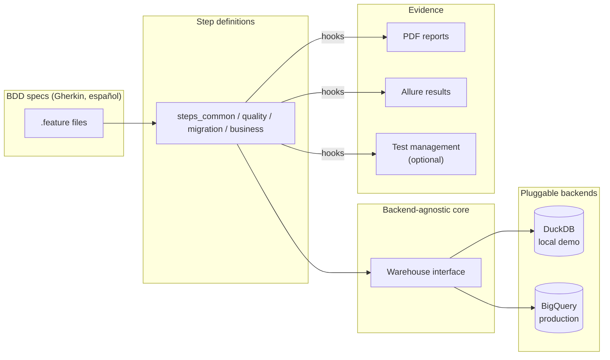

# Data Quality & Migration Validation Framework

A **BDD-based data testing framework** for validating data pipelines — both
functional/business rules and **on-premise → cloud (Google Cloud Platform) data
migrations**. It produces human-readable **PDF evidence reports** for product
owners and **Allure** dashboards for engineers.

> **Runs out of the box.** The demo ships with a self-contained
> [DuckDB](https://duckdb.org/) backend and **synthetic data** — clone, install,
> and run the full suite with zero cloud credentials or external infrastructure.

```
4 features passed, 14 scenarios passed, 40 steps passed
```

---

## Why this project

Data migrations (and data pipelines in general) fail silently: a schema drifts,
a join drops rows, a rounding rule changes a balance. This framework catches
those issues **automatically** and explains them in plain language:

- **For engineers** → Gherkin scenarios + Allure reports + executable checks.
- **For product owners** → a styled PDF per scenario showing *what* was
  validated, the exact query, the result set, and pass/fail status.

It was originally designed to validate financial data interfaces during an
on-premise → GCP/BigQuery migration. This public version is a **fully
anonymized, runnable reconstruction**: a fictional multi-fund investment
platform ("Veridian") with 100% synthetic data — no real client data, schemas,
or credentials.

## Key features

| Category | What it validates |
|---|---|
| **Schema** | Column names and data types match the expected contract |
| **Data quality** | Null checks, single/composite-key duplicates, date formats, numeric domains |
| **Migration reconciliation** | Row counts and business filters are preserved across `raw → curated → product` layers |
| **Business rules** | Recomputes balances from source (`shares × unit value`) and reconciles against the published product layer |
| **Evidence** | Auto-generated PDF per scenario + Allure results + optional test-management publishing |

## Architecture



The **same** `.feature` files and step definitions run against any backend. The
dialect-specific bits (schema introspection, partition metadata, regex syntax,
identifier quoting) live behind the `Warehouse` interface, so switching from the
local DuckDB demo to production BigQuery is just `DB_BACKEND=bigquery`.

## Quickstart

```bash
# 1. Create and activate a virtual environment (Python 3.10+)
python -m venv .venv
source .venv/bin/activate          # Windows: .venv\Scripts\activate

# 2. Install dependencies
pip install -r requirements.txt

# 3. Generate the synthetic dataset (creates data/veridian_demo.duckdb)
python data/generate_synthetic_data.py

# 4. Run the full validation suite
behave

# 5. (Optional) Run with Allure results, then open the dashboard
behave -f allure_behave.formatter:AllureFormatter -o allure-results
allure serve allure-results
```

PDF evidence is written to `reports/pdf/<feature>/<scenario>.pdf`.

## Sample evidence report

Each scenario produces a PDF showing every step, its status, the executed query,
and the result tables — including the business reconciliation (calculated vs.
published):

```
Reconciliar saldo calculado vs producto para el cliente 7
  ✔ Dado que estoy conectado al data warehouse                 PASSED
  ✔ Cuando obtengo los saldos en cuotas ...                    PASSED
  ✔ Y obtengo los valores cuota ...                            PASSED
  ✔ Entonces el saldo en pesos calculado coincide ...          PASSED

  Comparación calculado vs producto
  | tipo_fondo | saldo_pesos_calculado | saldo_pesos_real |
  | A          | 80244695.0            | 80244695.0       |
```

## Project structure

```
data-quality-framework/
├── features/
│   ├── *.feature                # BDD scenarios (Gherkin, Spanish)
│   ├── environment.py           # Behave hooks: evidence capture + reporting
│   └── steps/                   # Backend-agnostic step definitions
├── utils/
│   ├── warehouse.py             # Warehouse interface + DuckDB backend (demo)
│   ├── bigquery_client.py       # BigQuery backend (production)
│   ├── oracle_client.py         # Oracle source connector (production)
│   ├── pdf_generator.py         # ReportLab PDF evidence generator
│   └── test_management.py       # Optional Jira/AgileTest integration (no-op by default)
├── data/
│   └── generate_synthetic_data.py   # Deterministic synthetic data generator
├── requirements.txt             # Demo dependencies
├── requirements-prod.txt        # + production connectors
├── .env.example                 # Configuration template
└── behave.ini
```

## Configuration

Copy `.env.example` to `.env`. The demo needs no changes. Key variables:

- `DB_BACKEND` — `duckdb` (default) or `bigquery`.
- `DUCKDB_PATH` — path to the generated DuckDB file.
- `TEST_MGMT_ENABLED` — set `true` (plus Jira vars) to publish results and
  attach PDFs to a test-execution ticket. Off by default; the demo makes no
  network calls.

## Tech stack

- **Python 3.10+**, **behave** (BDD), **pandas**
- **DuckDB** (local demo engine), **Google BigQuery** + **Oracle** (production connectors)
- **ReportLab** (PDF), **Allure** (reporting)

## Notes

- All data, schemas, identifiers, and entity names are **fictional and
  synthetic**. No proprietary or client information is included.
- Production connectors (BigQuery, Oracle, Jira) are included to demonstrate
  real integrations but are **not exercised by the demo suite** — the demo is
  fully reproducible on DuckDB alone.

## License

[MIT](LICENSE)
